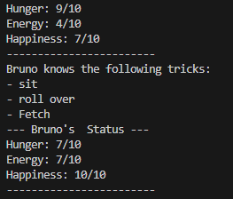

# 🐾 Virtual Pet Simulator

A fun and simple **Object-Oriented Programming (OOP)** project in Python that simulates a virtual pet. Control your pet's hunger, energy, and happiness levels while teaching it cool tricks!

---

## 🖼️ Screenshot Sample Output



## 🛠️ Technologies Used

Python 3

OOP (Classes, Methods, Encapsulation)

## 📌 Features

- ✅ **Track Vital Stats**  
  Monitor your pet’s `hunger`, `energy`, and `happiness` (each on a 0–10 scale).

- 🍽️ **eat()**  
  Reduces hunger by 3 (not below 0) and increases happiness by 1.

- 💤 **sleep()**  
  Increases energy by 5 (not above 10).

- 🕹️ **play()**  
  Uses energy, increases happiness, and raises hunger.

- 🎓 **train(trick)**  
  Teaches your pet a new trick.

- 🎪 **show_tricks()**  
  Displays all tricks your pet has learned.

- 📊 **get_status()**  
  Prints your pet’s current stats in a clean format.

---


---

## 🚀 Getting Started

### Prerequisites
- Python 3.x installed on your system

### Run the Project
1. Clone or download this repo.
2. Open a terminal and navigate to the project folder.
3. Run the main file:

```bash
python main.py


